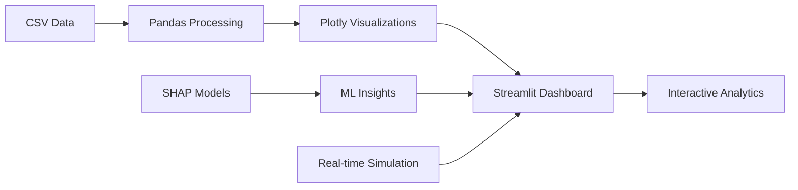

# 📊 Telemetry Monetization Dashboard

> **A comprehensive real-time telemetry monetization analytics platform** demonstrating end-to-end data visualization, pricing optimization, and business intelligence capabilities.

<div align="center">

[🚀 Getting Started](#-getting-started) • [📊 Usage](#-usage) • [🛠️ Tech Stack](#️-technology-stack) • [📈 Features](#-dashboard-features) • [🤝 Contributing](#-contributing)

[](https://python.org)
[](https://streamlit.io)
[](https://plotly.com)
[](https://shap.readthedocs.io)

</div>

---

## 🎯 Project Overview

This project delivers a production-grade telemetry monetization analytics dashboard featuring real-time monitoring, pricing elasticity analysis, A/B testing insights, machine learning predictions, and comprehensive business intelligence across multiple geographic regions.

**Challenge**: SaaS companies need unified analytics to understand real-time performance, optimize pricing strategies, track conversion funnels, and leverage ML insights for customer retention and revenue growth.

**Solution**: Integrated dashboard providing real-time telemetry monitoring, pricing optimization, funnel analysis, A/B testing results, ML-powered churn prediction, and geographic intelligence.

**Impact**: Comprehensive analytics platform enabling data-driven decisions for **conversion optimization**, **pricing strategies**, and **customer lifetime value maximization**.

## 📋 Dashboard Documentation

| Component | Purpose | Target Users |
|-----------|---------|--------------|
| **[📈 Overview Dashboard](#-overview-tab)** | High-level KPIs and business metrics | Executives, Product Leadership |
| **[📊 Real-Time Monitoring](#-real-time-monitoring)** | Live performance tracking and system health | DevOps, Operations Teams |
| **[🔄 Funnel Analysis](#-funnel-analysis)** | Conversion optimization and user journey insights | Growth Teams, Product Managers |
| **[💰 Pricing Strategy](#-pricing-strategy)** | Elasticity analysis and ARPU optimization | Revenue Teams, Finance |
| **[🧪 A/B Testing](#-ab-testing)** | Experiment results with statistical significance | Data Scientists, Growth Teams |
| **[🤖 ML Insights](#-ml-insights)** | Churn prediction and LTV modeling with SHAP | Data Science, Customer Success |
| **[🌍 Geographic Intelligence](#-geographic-intelligence)** | Regional performance and global analytics | International Teams, Strategy |

---

## ✨ Features

<div align="center">

### 🎯 Core Capabilities

</div>

<table>
<tr>
<td width="33%">

#### 📊 **Real-Time Analytics Engine**
- **Live Performance Monitoring** with 30-point time series
- **Conversion Rate Tracking** with real-time calculations
- **Error Rate Monitoring** with system health indicators
- **Session Analytics** with active user tracking
- **KPI Dashboard** with color-coded performance indicators

</td>
<td width="33%">

#### 🎛️ **Advanced Business Intelligence**
- **Pricing Elasticity Analysis** with plan-based segmentation
- **Funnel Optimization** with drop-off identification
- **A/B Testing Framework** with statistical significance testing
- **Geographic Intelligence** with US and global views
- **Executive Reporting** with trend analysis and benchmarks

</td>
<td width="33%">

#### 🤖 **Machine Learning Integration**
- **Churn Prediction Models** with probability scoring
- **Lifetime Value (LTV) Prediction** with feature importance
- **SHAP Explainability** with force plots and waterfall charts
- **Model Version Control** with performance tracking
- **Interactive ML Insights** with real-time explanations

</td>
</tr>
</table>

### 🎨 Dashboard Features

<details>
<summary><b>📈 Overview Tab</b></summary>

- **Key Metrics Display**: Elasticity, conversion rates, and plan metrics
- **MRR Tracking**: Monthly recurring revenue with trend analysis
- **Churn Rate Monitoring**: Customer retention performance over time
- **Data Integration**: Real-time filtering with pricing elasticity data
- **Executive KPIs**: Color-coded performance indicators with thresholds

</details>

<details>
<summary><b>📊 Real-Time Monitoring</b></summary>

- **Live Session Tracking**: Active user monitoring with 5-minute intervals
- **Conversion Monitoring**: Real-time conversion rate calculations
- **System Health**: Error rate tracking with visual alerts
- **Performance Metrics**: Current snapshot KPIs with trend indicators
- **Time Series Visualization**: Interactive charts with hover details

</details>

<details>
<summary><b>🔄 Funnel Analysis</b></summary>

- **User Journey Mapping**: Complete funnel from visitor to paid customer
- **Drop-off Analysis**: Identification of conversion bottlenecks
- **Dynamic Filtering**: Plan, region, and year-based segmentation
- **Conversion Optimization**: Visual funnel charts with step-by-step metrics
- **Performance Benchmarking**: Historical comparison and trend analysis

</details>

<details>
<summary><b>💰 Pricing Strategy</b></summary>

- **ARPU Analysis**: Average revenue per user by plan tier
- **User Distribution**: Customer segmentation across pricing plans
- **Elasticity Insights**: Price sensitivity analysis from main data
- **Revenue Optimization**: Strategic pricing recommendations
- **Plan Performance**: Comparative analysis across subscription tiers

</details>

<details>
<summary><b>🧪 A/B Testing</b></summary>

- **Experiment Selection**: Multiple test scenarios (button color, onboarding, CTA)
- **Statistical Methods**: Frequentist and Bayesian analysis options
- **Significance Testing**: P-value calculations and confidence intervals
- **Bayesian Inference**: Probability distributions and credible intervals
- **Power Analysis**: Sample size calculator with effect size estimation
- **Conversion Comparison**: Visual lift analysis with key metrics

</details>

<details>
<summary><b>🤖 ML Insights</b></summary>

- **Churn Prediction**: Customer risk scoring with SHAP feature importance
- **LTV Modeling**: Lifetime value predictions with explanatory features
- **Model Versioning**: Version control with performance metrics (v1.0, v1.1, v2.0)
- **SHAP Visualizations**: Force plots, waterfall charts, and decision plots
- **Performance Metrics**: Accuracy, AUC-ROC, RMSE, and R² tracking
- **Feature Importance**: Top predictive factors for each customer

</details>

<details>
<summary><b>🌍 Geographic Intelligence</b></summary>

- **Dual View Options**: US localized and global regional analysis
- **Interactive Maps**: Scatter mapbox with size and color encoding
- **City-Level Analysis**: US metropolitan area performance tracking
- **Global Regional View**: International performance with conversion mapping
- **Dynamic Filtering**: Region and plan-based geographic segmentation

</details>

---

## 🛠️ Technology Stack

<div align="center">



</div>

| Component | Technology | Purpose |
|-----------|------------|---------|
| **Frontend Framework** | Streamlit | Interactive web application with real-time updates |
| **Data Visualization** | Plotly Express/Graph Objects | Interactive charts, maps, and statistical plots |
| **Data Processing** | Pandas, NumPy | Data manipulation and statistical calculations |
| **Machine Learning** | SHAP, Scikit-learn | Model explainability and predictive analytics |
| **Statistical Analysis** | SciPy | A/B testing significance and Bayesian inference |
| **Geospatial Analytics** | Plotly Mapbox | Interactive geographic visualizations |
| **Styling** | Custom CSS | Modern UI with card layouts and responsive design |

---

## 🚀 Getting Started

### ⚡ Quick Launch (3 minutes)

<details>
<summary><b>🔧 Prerequisites</b></summary>

- Python 3.8+ installed
- Git (for cloning)
- 4GB RAM minimum
- Modern web browser (Chrome, Firefox, Safari)
- Internet connection (for Mapbox visualizations)

</details>

#### 1️⃣ **Clone & Setup**

```bash
# Clone the repository
git clone https://github.com/your-username/telemetry-monetization-dashboard.git
cd telemetry-monetization-dashboard

# Create virtual environment (recommended)
python -m venv venv
source venv/bin/activate  # macOS/Linux
# OR
venv\Scripts\activate     # Windows
```

#### 2️⃣ **Install Dependencies**

```bash
# Install required packages
pip install streamlit pandas plotly shap matplotlib numpy scipy joblib

# Or install from requirements file if available
pip install -r requirements.txt
```

#### 3️⃣ **Prepare Data Structure**

```bash
# Create data directory structure
mkdir -p data/processed

# Add your data files to the data/processed directory:
# - pricing_elasticity.csv
# - funnel_data.csv
```

#### 4️⃣ **Launch Dashboard**

```bash
# Start the Streamlit application
streamlit run streamlit_app.py

# Dashboard will open automatically at:
# 🌐 http://localhost:8501
```

#### 5️⃣ **Explore Analytics**

<div align="center">

| Tab | Key Features |
|-----|-------------|
| **📈 Overview** | Executive KPIs, MRR trends, churn analysis |
| **📊 Real-Time** | Live monitoring, session tracking, error rates |
| **🔄 Funnel** | Conversion analysis, drop-off identification |
| **💰 Pricing** | ARPU analysis, elasticity insights |
| **🧪 A/B Testing** | Experiment results, statistical significance |
| **🤖 ML Insights** | Churn prediction, LTV modeling, SHAP explanations |
| **🌍 Geographic** | Global and US regional performance mapping |

</div>

### 🔧 Advanced Configuration

<details>
<summary><b>Data File Requirements</b></summary>

**Required CSV Structure:**

`data/processed/pricing_elasticity.csv`:
```csv
plan,region,year,elasticity,conversion_rate
Basic,North America,2024,0.8,0.15
Pro,Europe,2024,1.2,0.22
Enterprise,APAC,2024,0.6,0.35
```

`data/processed/funnel_data.csv`:
```csv
step,count,step_order,region,plan,year
Visitor,10000,1,North America,Basic,2024
Signup,3000,2,North America,Basic,2024
Trial,1500,3,North America,Basic,2024
Paid,450,4,North America,Basic,2024
```

</details>

<details>
<summary><b>Customization Options</b></summary>

**Global Filters:**
- Modify sidebar filters in the script to match your data schema
- Add new regions, plans, or time periods
- Customize KPI thresholds and color coding

**Styling:**
- Update CSS in the `st.markdown()` section for custom branding
- Modify color schemes in Plotly charts
- Adjust layout spacing and container styling

**ML Models:**
- Replace SHAP simulation with real model loading using `joblib`
- Connect to your trained models for churn and LTV prediction
- Customize feature names and model performance metrics

</details>

<details>
<summary><b>Performance Optimization</b></summary>

```python
# Add caching decorators for better performance
@st.cache_data
def load_large_datasets():
    # Your data loading logic
    return data

# Optimize filtering operations
@st.cache_data
def filter_data(df, filters):
    # Cached filtering logic
    return filtered_df
```

</details>

---

## 📊 Usage

### 🎨 Dashboard Navigation

<div align="center">

**Main Navigation Tabs**

| Tab | Primary Use Case | Key Insights |
|-----|------------------|--------------|
| **Overview** | Executive reporting and high-level KPIs | Business health, trends, performance summary |
| **Real-Time** | Operations monitoring and system health | Live performance, conversion tracking, error monitoring |
| **Funnel** | Growth optimization and conversion analysis | User journey, drop-off points, optimization opportunities |
| **Pricing** | Revenue strategy and pricing optimization | ARPU trends, elasticity analysis, plan performance |
| **A/B Testing** | Experiment validation and statistical analysis | Test results, significance testing, lift calculation |
| **ML Insights** | Predictive analytics and customer intelligence | Churn risk, LTV prediction, feature importance |
| **Geographic** | Regional performance and market analysis | Global trends, regional conversion, geographic opportunities |

</div>

### 📈 Key Analytics Workflows

<details>
<summary><b>🎯 Executive Reporting Workflow</b></summary>

1. **Start with Overview Tab**: Review key metrics and business health
2. **Check Real-Time Monitoring**: Assess current performance and system status
3. **Analyze Geographic Performance**: Understand regional variations and opportunities
4. **Review ML Insights**: Identify at-risk customers and high-value prospects
5. **Export Key Findings**: Use insights for strategic decision-making

</details>

<details>
<summary><b>📊 Growth Optimization Workflow</b></summary>

1. **Funnel Analysis**: Identify conversion bottlenecks and drop-off points
2. **A/B Testing Review**: Validate experiment results and statistical significance
3. **Pricing Strategy**: Analyze ARPU and elasticity for optimization opportunities
4. **Geographic Targeting**: Focus on high-performing regions and expansion opportunities
5. **ML-Driven Insights**: Use churn prediction for proactive customer success

</details>

<details>
<summary><b>🔧 Technical Monitoring Workflow</b></summary>

1. **Real-Time Dashboard**: Monitor live sessions, conversions, and error rates
2. **Performance Alerts**: Check KPI color indicators for threshold breaches
3. **Historical Trends**: Analyze time series data for pattern identification
4. **System Health**: Review error rates and performance metrics
5. **Data Quality**: Validate funnel consistency and data integrity

</details>

### 🌐 Global Filtering System

The dashboard features a comprehensive filtering system accessible via the sidebar:

- **Pricing Plan Filter**: All, Basic, Pro, Enterprise
- **Region Filter**: All, North America, Europe, APAC, LATAM  
- **Year Slider**: 2021-2024 range selection
- **Real-time Updates**: All visualizations update dynamically with filter changes

---

## 📈 Business Impact & Analytics

<div align="center">

### 💼 Key Metrics Tracked

| Metric Category | Key Indicators | Business Value |
|-----------------|----------------|----------------|
| **Revenue Analytics** | MRR, ARPU, Conversion Rates | Revenue optimization and growth tracking |
| **Customer Intelligence** | Churn prediction, LTV, Retention | Customer success and lifetime value maximization |
| **Operational Excellence** | Real-time sessions, Error rates, System health | Performance monitoring and reliability |
| **Growth Optimization** | Funnel analysis, A/B testing, Geographic performance | Conversion optimization and market expansion |

### 🎯 Business Outcomes

| Capability | Impact Area | Value Delivered |
|------------|-------------|-----------------|
| **Real-Time Monitoring** | Operational efficiency | Immediate issue detection and response |
| **Pricing Optimization** | Revenue growth | Data-driven pricing strategy development |
| **Churn Prediction** | Customer retention | Proactive customer success interventions |
| **Geographic Intelligence** | Market expansion | Regional performance optimization |
| **A/B Testing Framework** | Product optimization | Evidence-based feature and design decisions |

</div>

---

## 📁 Project Structure

```
telemetry-monetization-dashboard/
├── 📊 streamlit_app.py               # Main dashboard application
├── 📈 data/
│   └── processed/
│       ├── pricing_elasticity.csv   # Price sensitivity data
│       └── funnel_data.csv          # Conversion funnel metrics
├── 📋 requirements.txt               # Python dependencies
├── 📚 docs/
│   ├── data_dictionary.md           # Data schema documentation
│   ├── user_guide.md               # Dashboard usage guide
│   └── technical_specs.md          # Technical implementation details
├── 🔧 config/
│   ├── dashboard_config.py         # Configuration settings
│   └── styling.css                 # Custom CSS styles
├── 🧪 tests/
│   ├── test_data_processing.py     # Unit tests for data functions
│   └── test_visualizations.py      # Visualization testing
└── 📜 README.md                    # This file
```

---

## 🔍 Advanced Features

<details>
<summary><b>📊 Real-Time Simulation Engine</b></summary>

### Live Data Generation
- **Dynamic Timestamps**: 30 data points with 5-minute intervals
- **Realistic Metrics**: Sessions (80-150), conversions (5-25), error rates (0.1-1.0%)
- **Statistical Variation**: Numpy random generation with controlled ranges
- **Performance Calculations**: Real-time conversion rate computation
- **Trend Analysis**: Historical pattern simulation for realistic business scenarios

### Key Capabilities
- **Session Monitoring**: Active user tracking with trend visualization
- **Conversion Analysis**: Real-time rate calculations with performance indicators
- **Error Tracking**: System health monitoring with visual alerts
- **KPI Dashboard**: Snapshot metrics with threshold-based color coding
- **Time Series Charts**: Interactive Plotly visualizations with hover details

</details>

<details>
<summary><b>🧪 A/B Testing Statistical Framework</b></summary>

### Statistical Methods
- **Frequentist Analysis**: P-value calculation with significance testing
- **Bayesian Inference**: Beta-binomial modeling with probability distributions
- **Power Analysis**: Sample size estimation with effect size calculation
- **Confidence Intervals**: Statistical significance assessment
- **Lift Calculation**: Performance improvement measurement

### Experiment Types
- **UI/UX Tests**: Button color, layout, and design variations
- **User Experience**: Onboarding flow and user journey optimization
- **Conversion Optimization**: CTA placement and messaging effectiveness
- **Feature Testing**: Product feature impact on key metrics

</details>

<details>
<summary><b>🤖 Machine Learning Integration</b></summary>

### Predictive Models
- **Churn Prediction**: Customer risk scoring with probability assessment
- **Lifetime Value (LTV)**: Revenue prediction with feature importance
- **Feature Engineering**: SHAP value calculation for model explainability
- **Model Versioning**: Version control with performance tracking
- **Performance Metrics**: Accuracy, AUC-ROC, RMSE, and R² monitoring

### SHAP Explainability
- **Force Plots**: Individual prediction explanation with feature contributions
- **Waterfall Charts**: Step-by-step feature impact visualization
- **Decision Plots**: Multi-sample comparison with feature pathways
- **Feature Importance**: Global and local feature ranking
- **Interactive Visualizations**: Dynamic SHAP plot generation

</details>

<details>
<summary><b>🌍 Geographic Intelligence System</b></summary>

### Mapping Capabilities
- **Dual View Modes**: US localized and global regional analysis
- **Interactive Mapbox**: Scatter plots with size and color encoding
- **City-Level Analysis**: US metropolitan area performance tracking
- **Regional Performance**: Global conversion rate mapping
- **Dynamic Filtering**: Geography-based data segmentation

### Data Integration
- **Coordinate Mapping**: Region to latitude/longitude conversion
- **Performance Metrics**: Customer count and conversion rate visualization
- **Hover Interactions**: Detailed metrics on map element interaction
- **Zoom Controls**: Multi-level geographic exploration
- **Responsive Design**: Mobile-optimized map visualization

</details>

---

## 🏆 Technical Excellence

### Code Quality & Architecture
- **Modular Design**: Clean separation of concerns with reusable components
- **Performance Optimization**: Caching decorators and efficient data processing
- **Error Handling**: Robust exception management and user feedback
- **Responsive UI**: Mobile-friendly design with adaptive layouts
- **Documentation**: Comprehensive inline comments and docstrings

### Data Processing Excellence
- **Pandas Integration**: Efficient data manipulation and analysis
- **Statistical Computing**: SciPy integration for advanced analytics
- **Visualization Framework**: Plotly integration for interactive charts
- **Real-time Simulation**: Dynamic data generation for demo purposes
- **Filter System**: Global filtering with cascading updates

### Security & Best Practices
- **Input Validation**: Data type checking and boundary validation
- **Error Recovery**: Graceful handling of missing or malformed data
- **Performance Monitoring**: Efficient memory usage and processing
- **Scalable Architecture**: Designed for production deployment
- **Version Control**: Git-ready with proper project structure

---

## 🤝 Contributing

We welcome contributions to enhance this telemetry monetization platform! 🎉

[](#-contributing)

### 🛠️ How to Contribute

1. **🍴 Fork the repository** to your GitHub account
2. **🌿 Create a feature branch**: `git checkout -b feature/add-new-analytics`
3. **💻 Make your changes**: Implement features or bug fixes
4. **✅ Test thoroughly**: Ensure changes work with existing functionality
5. **📝 Commit with clear messages**: `git commit -m "feat: Add new analytics feature"`
6. **🚀 Push to your branch**: `git push origin feature/your-feature-name`
7. **📬 Open a Pull Request**: Submit PR with clear description of changes

### 🎯 Contribution Areas

<table>
<tr>
<td width="50%">

**🔧 Technical Enhancements**
- Add new dashboard tabs and analytics capabilities
- Implement real data source connections
- Enhance ML model integration and predictions
- Improve performance and caching strategies
- Add new visualization types and interactive features

</td>
<td width="50%">

**📚 Documentation & Examples**
- Create video tutorials and demos
- Add more comprehensive user guides
- Write technical implementation blogs
- Provide deployment instructions for various platforms
- Translate documentation to other languages

</td>
</tr>
</table>

### 📋 Development Guidelines

- **Code Style**: Follow PEP 8 for Python, use tools like `black` and `flake8`
- **Testing**: Add unit tests for new functions and components
- **Documentation**: Update README and inline documentation for new features
- **Performance**: Consider performance implications, especially for large datasets
- **User Experience**: Maintain intuitive design and responsive layouts

---

## 📬 Contact & Support

**Project Creator**: [Your Name]  
**LinkedIn**: [your-linkedin-profile]  
**Email**: [your-email@example.com]  
**GitHub**: [your-github-username]

### 📚 Support Resources
- 📋 **Documentation**: Inline code comments and docstrings
- 🐛 **Issues**: GitHub Issues tab for bug reports
- 💬 **Discussions**: GitHub Discussions for feature requests
- 📧 **Direct Contact**: Email for collaboration opportunities

### Community & Feedback
- 🌟 **Star the repository** if you find it valuable
- 🍴 **Fork and customize** for your own analytics needs
- 🐛 **Report issues** via GitHub Issues
- 💡 **Suggest enhancements** via GitHub Discussions
- 📧 **Share your implementation** via email or social media

---

## 📄 License

This project is released under the **MIT License**. Feel free to use, modify, and distribute for personal and commercial purposes.

**Attribution**: If you use this project as inspiration or reference, please provide appropriate credit and link back to the original repository.

---

<div align="center">

### 🚀 **Ready to explore telemetry monetization analytics?**

```bash
streamlit run streamlit_app.py
```

**🌟 Star this repo if you found it helpful!** ⭐

[](https://github.com/your-username/telemetry-monetization-dashboard/stargazers)

*Built with ❤️ for data-driven decision making | Last Updated: June 2025*

</div>
